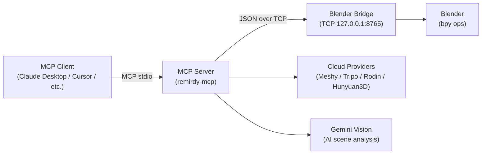

# Remirdy Blender Studio MCP

[](LICENSE)
[](https://www.python.org/)
[](https://www.blender.org/)
[](pyproject.toml)

A local [Model Context Protocol (MCP)](https://modelcontextprotocol.io/) bridge that lets any MCP-capable AI client control Blender directly — building 3D scenes, generating assets, importing AI-generated models, and rendering previews, all through natural-language prompts.

---

## Architecture



The MCP server never executes arbitrary Python in Blender. It only sends **named operation strings** that Blender dispatches through `blender_addon/blender_ops/registry.py` — keeping arbitrary code execution out of the default surface area.

---

## Features

### 🧠 AI Vision Scene Analysis (v0.2.0 — NEW)

Point the system at a **PSD, PSB, PNG, or JPEG** concept art file and it will use **Google Gemini 2.5-flash** to:

- Identify every object in the image with its type, position, material, and scale
- Generate a structured 3D scene plan (lighting, camera angle, mood, colour palette)
- Analyse individual PSD layers to determine what 3D role each should play
- Fall back silently to colour-sampling analysis when no API key is set

### 🎮 Scene Generation

| Tool category | Count | Examples |
|---|---|---|
| Scene & Prompt | 8 | `create_scene_from_prompt`, `create_cinematic_scene` |
| Game Environment | 14 | `create_game_environment`, `create_game_level_blockout` |
| Interior Design | 7 | `create_interior_design_scene`, `add_furniture_set` |
| Architecture | 4 | `create_architectural_exterior`, `create_facade` |
| Modular / Kitbash | 11 | `create_modular_set`, `assemble_from_modules` |
| Product Render | 7 | `create_product_render_scene`, `apply_product_material` |

### 🖼️ Image → 3D Model

| Provider | API Key | Speed | Notes |
|---|---|---|---|
| **Meshy** | `MESHY_API_KEY` | ~60 s | PBR textures, quad mesh |
| **Tripo** | `TRIPO_API_KEY` | ~45 s | Excellent topology |
| **Rodin** (Hyper3D) | `RODIN_API_KEY` | ~90 s | High detail |
| **Hunyuan3D** (Tencent) | `HUNYUAN3D_API_KEY` | ~120 s | Open-weight cloud |
| **Local** (TripoSR / custom) | `REMIRDY_LOCAL_IMAGE_TO_3D_COMMAND` | varies | Runs fully offline |
| **Parallel** | — | fastest wins | Cloud + local race |

### ✨ Assets, Materials & Quality

Characters (11 tools) · Materials (11) · Assets (11) · Quality checks (17) · Rendering (12) · Export (8)

---

## Quick start

### 1 — Install the MCP server

```bash
git clone https://github.com/remirdy/remirdy-blender-studio-mcp.git
cd remirdy-blender-studio-mcp

python3 -m venv .venv && source .venv/bin/activate
pip install -e .

# Optional: set your API keys
cp .env.example .env && nano .env
```

### 2 — Install the Blender add-on

```bash
python scripts/package_addon.py
```

In Blender: **Edit → Preferences → Add-ons → Install** → select `dist/remirdy_blender_studio.zip` → enable **Remirdy Blender Studio MCP** → press **N** in the 3D viewport → **Remirdy MCP** tab → **Start Bridge**.

### 3 — Connect your MCP client

Default desktop MCP clients should use the stdio transport:

Add to your MCP client config (e.g. `claude_desktop_config.json`):

```json
{
  "mcpServers": {
    "remirdy-blender": {
      "command": "python",
      "args": ["-m", "server.main"],
      "cwd": "/absolute/path/to/remirdy-blender-studio-mcp",
      "env": {
        "REMIRDY_WORKSPACE": "/Users/you/RemirdyWorkspace"
      }
    }
  }
}
```

For local HTTP testing:

```bash
remirdy-mcp --transport http
```

This starts the streamable HTTP endpoint at:

```
http://127.0.0.1:8000/mcp
```

For ChatGPT developer mode, expose the MCP endpoint through HTTPS:

```bash
remirdy-mcp --transport https
```

The command auto-detects `ngrok` or `cloudflared`, starts a tunnel, and prints a
ChatGPT-ready URL like:

```
https://example.ngrok-free.app/mcp
```

Paste that URL into **ChatGPT → Settings → Apps → Create app → MCP server
endpoint**, then scan tools. If you already have your own HTTPS reverse proxy,
skip tunnel startup:

```bash
remirdy-mcp --transport https --tunnel none --public-url https://your-domain.example
```

### 4 — Try a prompt

```
connect_blender
```

```
Create a small Mediterranean terrace scene — warm golden-hour lighting,
terracotta tiles, some potted plants, and a wrought-iron table. Export as GLB.
```

---

## AI Vision setup (optional but recommended)

Get a free API key at [Google AI Studio](https://aistudio.google.com/) and add it to your `.env`:

```
GEMINI_API_KEY=your_key_here
```

Then try:

```
Build a 3D scene from ~/Desktop/concept_art.psd using AI vision analysis.
Use the detected object positions and materials for accurate placement.
```

Without an API key the system falls back to colour-based analysis — it still works, just less accurately for complex scenes.

---

## Supported formats

| Input | Output |
|---|---|
| PSD, PSB (Photoshop) | `.blend` |
| PNG, JPEG, WEBP | `.glb` (glTF binary) |
| GLB (import) | `.fbx` |
| — | `.obj` |

---

## Tool reference (all categories)

| Category | Module | Tools |
|---|---|---|
| Connection | `connection_tools` | connect_blender, disconnect_blender, get_connection_status, ping_blender, … |
| Scene | `scene_tools` | create_scene_from_prompt, get_scene_summary, setup_camera, clear_scene, … |
| Rendering | `render_tools` | render_preview, apply_render_preset, setup_lighting, set_render_resolution, … |
| Materials | `material_tools` | apply_material_preset, create_pbr_material, set_object_color, bulk_assign_material, … |
| Characters | `character_tools` | create_rigged_character, add_animation_clip, set_character_pose, rig_character, … |
| Assets | `asset_tools` | create_prop, duplicate_object, merge_objects, apply_transform, … |
| Game | `game_tools` | create_game_environment, create_game_level_blockout, add_collision_mesh, … |
| Interior | `interior_tools` | create_interior_design_scene, add_furniture_set, add_lighting_plan, … |
| Architecture | `architecture_tools` | create_architectural_exterior, create_facade, add_windows, add_roof, … |
| Modular | `modular_tools` | create_modular_set, assemble_from_modules, snap_to_grid, … |
| Product | `product_tools` | create_product_render_scene, apply_product_material, add_product_lighting, … |
| Image → 3D | `reference_asset_tools` | create_3d_asset_from_reference_image, build_layered_scene_from_image, … |
| Asset Source | `asset_source_tools` | search_polyhaven, download_hdri, download_texture, list_asset_packs, … |
| Import | `import_tools` | import_glb, import_fbx |
| Export | `export_tools` | export_glb, export_fbx, export_obj, export_blend, … |
| Quality | `quality_tools` | scene_quality_check, auto_fix_scene, check_mesh_errors, optimize_scene, … |
| Understanding | `understanding_tools` | analyse_scene, describe_objects, get_material_report, … |
| Marketplace | `marketplace_tools` | browse_marketplace, download_asset, install_asset, … |
| Telemetry | `telemetry_tools` | get_telemetry, reset_telemetry, toggle_telemetry |

Full parameter docs: [`docs/tool_reference.md`](docs/tool_reference.md)

---

## Repository layout

```
blender_addon/              Blender add-on (runs inside Blender)
  blender_ops/              Operation handlers + registry
  bridge_server.py          TCP bridge server
server/                     MCP server (runs on the host)
  tools/                    MCP tool definitions (one file per category)
  providers/                Image-to-3D provider adapters
  utils/                    Shared helpers: psd_utils, ai_vision, validation, …
tests/                      Server-side pytest suite (no Blender needed)
examples/prompts/           Copy-paste prompt examples
docs/                       Extended documentation
scripts/                    Packaging, TripoSR install helper
```

---

## Running the tests

```bash
pip install -e ".[dev]"
python -m pytest tests/ -v
```

---

## Environment variables

See [`.env.example`](.env.example) for the full list with descriptions. Key variables:

| Variable | Default | Purpose |
|---|---|---|
| `REMIRDY_WORKSPACE` | `~/RemirdyWorkspace` | Output directory |
| `REMIRDY_BRIDGE_TIMEOUT` | `3900` | Bridge socket timeout (seconds) |
| `GEMINI_API_KEY` | — | Enables AI vision scene analysis |
| `MESHY_API_KEY` | — | Meshy cloud image-to-3D |
| `TRIPO_API_KEY` | — | Tripo cloud image-to-3D |
| `RODIN_API_KEY` | — | Rodin (Hyper3D) cloud image-to-3D |
| `HUNYUAN3D_API_KEY` | — | Hunyuan3D cloud image-to-3D |
| `REMIRDY_LOCAL_IMAGE_TO_3D_COMMAND` | — | Local image-to-3D command template |
| `REMIRDY_LOG_LEVEL` | `INFO` | Logging verbosity |

---

## Troubleshooting

| Symptom | Fix |
|---|---|
| `Could not reach the Blender bridge` | Blender open? Add-on enabled? **Start Bridge** clicked? |
| Image-to-3D falls back to procedural | Check `fallback_reason` in response; verify API key or local command |
| Gemini vision disabled | Set `GEMINI_API_KEY` in `.env`; run `pip install google-genai` |
| TripoSR very slow | Likely on CPU — lower `TRIPOSR_MC_RESOLUTION` or use a GPU machine |
| Render is empty | Run `setup_camera` or `auto_fix_scene` first |
| PSD layers not extracted | Run `pip install psd-tools Pillow` |

---

## Safety model

The bridge only dispatches **named operations** registered in `registry.py`. No arbitrary Python execution. File output is kept under `REMIRDY_WORKSPACE`. See [`docs/safety.md`](docs/safety.md) for details.

---

## Contributing

See [`CONTRIBUTING.md`](CONTRIBUTING.md) for dev setup, code structure, and how to add new tools or providers.

---

## License

MIT — see [LICENSE](LICENSE). Check the licenses of any local image-to-3D model weights you install separately before using their output commercially.
