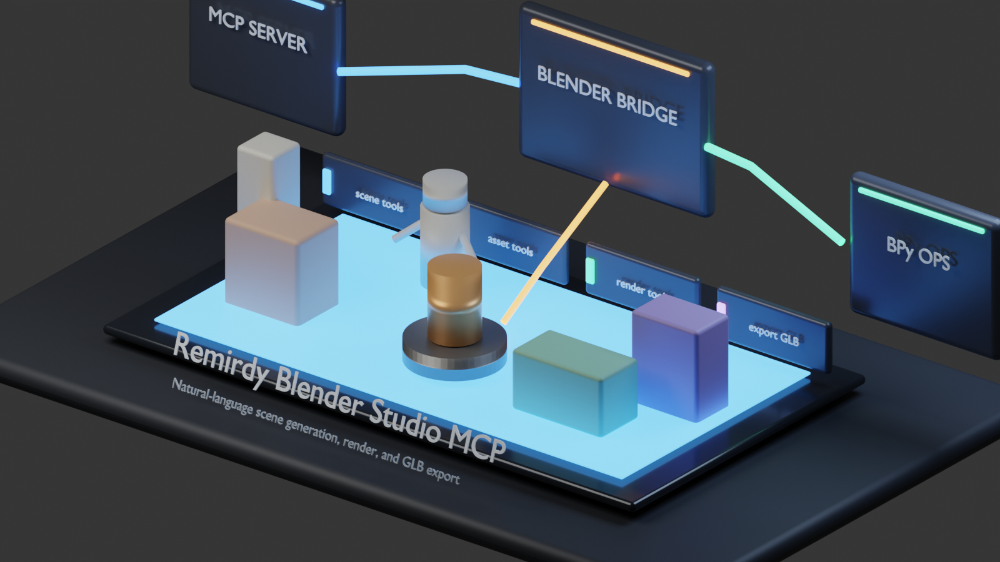
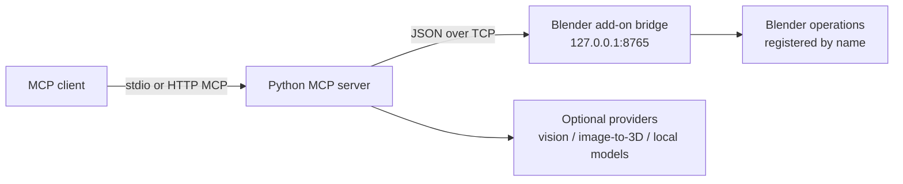

# Remirdy Blender Studio MCP

[](LICENSE)
[](https://github.com/Remirdy/BlenderMCP/actions/workflows/ci.yml)
[](https://www.python.org/)
[](https://www.blender.org/)
[](pyproject.toml)

Remirdy Blender Studio MCP is a local Model Context Protocol server for working
with Blender from an MCP-capable client. It runs a small Python server on your
machine, talks to a Blender add-on over a local TCP bridge, and exposes named
tools for scene creation, rendering, import/export, materials, quality checks,
and character workflows.

The project is intentionally local-first. Blender operations run through a
registered operation list; there is no generic "execute arbitrary Python" tool
in the default bridge.



The render above was generated in Blender from this repository:

```bash
/Applications/Blender.app/Contents/MacOS/Blender --background --python scripts/create_readme_hero_scene.py
```

## What It Does

- Connects MCP clients to a running Blender session.
- Builds scene blockouts from prompts using Blender-side operations.
- Creates cameras, lighting, materials, props, interiors, architecture, and game-environment layouts.
- Renders previews and final images.
- Exports `.glb`, `.fbx`, `.obj`, and `.blend` files to a local workspace.
- Supports optional image-to-3D and vision providers when you configure them.
- Provides local/API-free fallbacks for several workflows.

Some advanced features are still under active development. The docs try to call
out where a workflow is production-ready, experimental, or provider-dependent.

## Architecture



The operation registry lives in
[`blender_addon/blender_ops/registry.py`](blender_addon/blender_ops/registry.py).
That file is the source of truth for what the server is allowed to ask Blender
to do.

## Quick Start

### 1. Install the MCP server

```bash
git clone https://github.com/Remirdy/BlenderMCP.git
cd BlenderMCP

python3 -m venv .venv
source .venv/bin/activate
pip install -e ".[dev]"
```

Optional provider settings live in `.env`:

```bash
cp .env.example .env
```

Only fill in the keys you actually use.

### 2. Install the Blender add-on

```bash
python scripts/package_addon.py
```

In Blender:

1. Open **Edit -> Preferences -> Add-ons -> Install**.
2. Select `dist/remirdy_blender_studio.zip`.
3. Enable **Remirdy Blender Studio MCP**.
4. In the 3D viewport, press **N**, open the **Remirdy MCP** tab, and click **Start Bridge**.

### 3. Register the MCP server

Example MCP client config:

```json
{
  "mcpServers": {
    "remirdy-blender": {
      "command": "python",
      "args": ["-m", "server.main"],
      "cwd": "/absolute/path/to/BlenderMCP",
      "env": {
        "REMIRDY_WORKSPACE": "/Users/you/RemirdyWorkspace"
      }
    }
  }
}
```

Restart your client, then run:

```text
connect_blender
```

Try a small scene:

```text
Create a Mediterranean terrace scene with warm evening light, terracotta tiles,
potted plants, and a small wrought-iron table. Render a preview and export GLB.
```

## Transports

Most desktop clients use stdio:

```bash
python -m server.main
```

For local HTTP testing:

```bash
remirdy-mcp --transport http
```

This exposes:

```text
http://127.0.0.1:8000/mcp
```

For HTTPS testing, the CLI can use `ngrok` or `cloudflared` when installed:

```bash
remirdy-mcp --transport https
```

## Optional Providers

The base bridge does not require cloud APIs. Provider-backed workflows are
enabled only when configured.

| Workflow | Configuration |
|---|---|
| Gemini image/PSD analysis | `GEMINI_API_KEY` |
| Meshy image-to-3D | `MESHY_API_KEY` |
| Tripo image-to-3D | `TRIPO_API_KEY` |
| Rodin / Hyper3D image-to-3D | `RODIN_API_KEY` |
| Hunyuan3D image-to-3D | `HUNYUAN3D_API_KEY` |
| Local image-to-3D command | `REMIRDY_LOCAL_IMAGE_TO_3D_COMMAND` |
| API-free human provider | local Blender add-on such as MPFB/MakeHuman, when installed |

When no provider is configured, tools should either use a local fallback or
return a clear `fallback_reason`.

## Common Tools

| Category | Examples |
|---|---|
| Connection | `connect_blender`, `get_connection_status`, `ping_blender` |
| Scene | `create_scene_from_prompt`, `clear_scene`, `get_scene_summary` |
| Rendering | `render_preview`, `render_final`, `apply_render_preset` |
| Materials | `create_material`, `apply_material`, `build_shader_node_graph` |
| Characters | `create_rigged_character`, `create_api_free_runway_show`, `export_character_glb` |
| Import/export | `import_glb`, `export_glb`, `export_fbx`, `export_blend` |
| Quality | `scene_quality_check`, `auto_fix_scene`, `optimize_scene` |

Full tool notes are in [`docs/tool_reference.md`](docs/tool_reference.md).

## Repository Layout

```text
blender_addon/              Blender add-on and operation handlers
  blender_ops/              Blender-side named operations
server/                     MCP server and tool definitions
  tools/                    MCP tool modules
  providers/                Optional provider adapters
  utils/                    Shared server utilities
tests/                      Server-side tests that do not require Blender
examples/prompts/           Prompt examples
docs/                       Installation, usage, safety, and roadmap notes
scripts/                    Packaging and reproducible demo scripts
```

## Tests

```bash
python -m pytest tests/ -v
```

Blender-side changes should also be smoke-tested by packaging the add-on,
starting the bridge in Blender, and running `connect_blender`.

## Safety

- The MCP server talks to Blender through named operations only.
- The bridge is local by default.
- Generated files are written under `REMIRDY_WORKSPACE`.
- Secrets belong in `.env` or the MCP client environment, not in Git.

See [`docs/safety.md`](docs/safety.md) and [`SECURITY.md`](SECURITY.md).

## Contributing

See [`CONTRIBUTING.md`](CONTRIBUTING.md).

## License

MIT. See [`LICENSE`](LICENSE).
